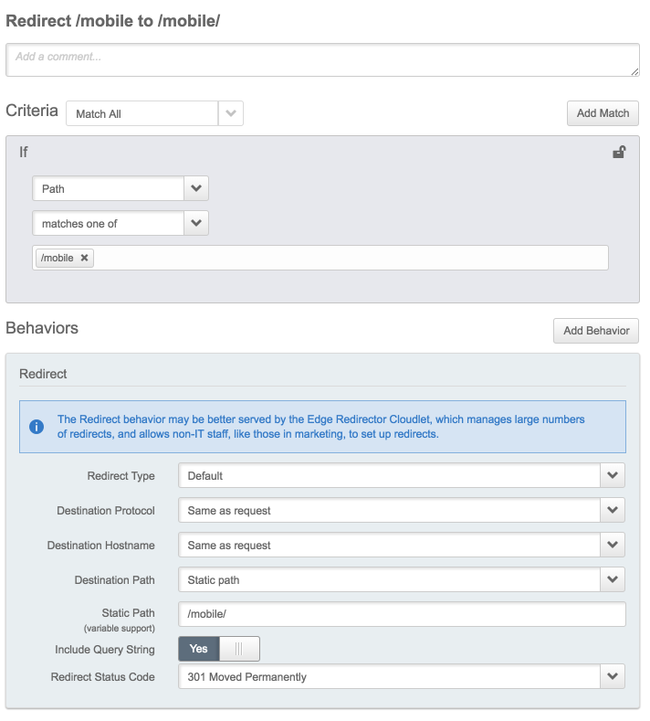

# Name of your snippet 
For example "Redirect specific URL without slash to same URL with a slash at the end"  
**This is an alternate implementation that uses Jsonnet.**

# Use Case
Explain the use case your code is going to provide. For example:
```
Some Web Servers only return the default html file (usually index.html) when the URL ends in a slash. The code below automatically returns 
a permanent redirect for a specific URL which does not end with a slash with a counterpart URL ending in slash so the default HTML can be
displayed
```

# Installation instructions:

## Using the Property Manager User Interface
* Login to the Luna Control Center (Akamai Console) at https://control.akamai.com/ 
* Press the Context Selector Orange Button 

* Type the name of the property you want to modify and click on the hyperlink
* Click the gearbox icon on the "Actions" column of the version you want to build your configuration upon and click "Edit New Version"
* Click the "Add Rule" button, select "Blank Rule Template", give it a name and click "Insert Rule"
* Follow the screenshot below to define the rule

* Save the configuration and Activate in Staging
* Test the new functionality on the Staging network

## Using the [Property Manager API (PAPI)](https://developer.akamai.com/api/luna/papi/overview.html), the [Akamai CLI](https://developer.akamai.com/cli) and the [Akamai Jsonnet CLI](https://github.com/akamai-contrib/cli-jsonnet)

> Jsonnet is a superset of JSON that provides syntax for reducing boilerplate and increasing modularity.

Redirection snippet is implemented as function in Jsonnet - see [papi-stdlib.libsonnet](./papi-stdlib.libsonnet) for reference.

In order to use it in your property (that should also be managed with Jsonnet), import the file first:

```
local papi_std = import 'papi-stdlib.libsonnet';
```

and invoke function whenever you want this rule be inserted:

```
    ...
    "rules": {
        "name": "default",
        "children": [ 
            ...,
            papi_std.redirect_to_dir_with_slash("/mobile")
        ],
        "behaviors": [
            {
                "name": "origin",
                ...
```

When Jsonnet property is compiled to JSON, the function will return redirection in JSON and the code will be injected into the final JSON:

```
❯ jsonnet -J . my_property.v234.jsonnet > my_property.v234.jsonnet
❯ cat my_property.v234.jsonnet

    ...
    "rules": {
        "name": "default",
        "children": [
          ...,
          {
             "behaviors": [
                {
                   "name": "redirect",
                   "options": {
                      "destinationHostname": "SAME_AS_REQUEST",
                      "destinationPath": "OTHER",
                      "destinationPathOther": "/mobile/",
                      "destinationProtocol": "SAME_AS_REQUEST",
                      "mobileDefaultChoice": "DEFAULT",
                      "queryString": "APPEND",
                      "responseCode": 301
                   }
                }
             ],
             "children": [ ],
             "criteria": [
                {
                   "name": "path",
                   "options": {
                      "matchCaseSensitive": false,
                      "matchOperator": "MATCHES_ONE_OF",
                      "values": [
                         "/mobile"
                      ]
                   }
                }
             ],
             "criteriaMustSatisfy": "all",
             "name": "Redirect /mobile to /mobile/"
          }
       ],
       "behaviors": [
        {
           "name": "origin",
           ...
```
